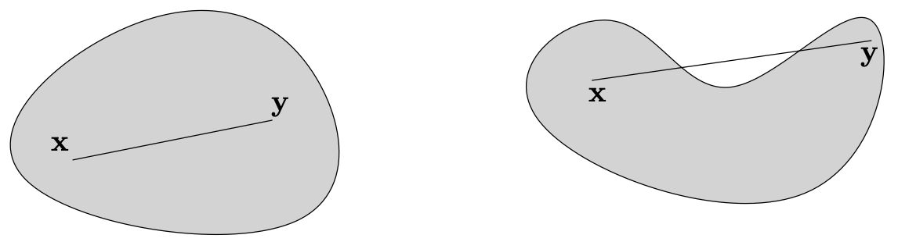

# Chatpter 1

Cauchy-Schwarz Inequality
$$
|\mathbf{u}^T\mathbf{v}| \leq || \mathbf{u}||||\mathbf{v}||
\\
|\mathbf{u}^T\mathbf{v}| = || \mathbf{u}||||\mathbf{v}||\cos \theta, \cos\theta\in [-1. 1]
$$
Norm
$$
||\lambda A|| = |\lambda| ||A|| \\
||A+B|| \leq ||A|| + ||B||\\
||A|| = 0 \to A = 0
$$
Mean Value Theorem

令 $a < b, a,b\in \mathbb{R}, h:[a, b]\to \mathbb{R}$ 且 $h$ 是连续可导对函数，则存在 $c$ 使的 $h$ 的导数 $h'$:
$$
h'(c) = \frac{h(b) - h(a)}{b -a}
$$
Calculus

令 $a < b, a,b\in \mathbb{R}, h:\mathbf{dom}(h)\to \mathbb{R}$ 且 $h$ 是连续可导对函数，且 $[a, b] \subset \mathbf{dom}(h)$，则有
$$
h(b)- h(a) = \int^b_a h'(t) dt
$$
Differentiability

对于函数 $f: \mathbf{dom}(f) \to \mathbb{R}^m$, 且 $\mathbf{dom}(f)\subset \mathbb{R}^d$, 函数被称为 differntiable 于 $\mathbf{x} \in \mathbf{dom}(f)$, 如果存在一个矩阵 $A_{(m\times d)}$,   和损失函数 $r : \mathbb{R}^d \to \mathbb{R}^m$ 定义于 $\mathbf{0} \in \mathbb{R}^d$ 的领域，使得所有在 $\mathbf{x}$ 一些的领域（some neighbourhood）中的$\mathbf{y}$：
$$
f(\mathbf{y}) = f(\mathbf{y-x}) + r(\mathbf{y-x}) \quad \text{where } \lim_{\mathbf{v\to 0}} \frac{||r(\mathbf{v})||}{||\mathbf{v}||} = \mathbf{0}
$$
我们称呼矩阵 $A$ 为函数 $f$ 对于 $\mathbf{x}$ 的 Jacobian 矩阵，计为 $D f(\mathbf{x})_{ij} = \frac{\part f_i}{\part x_j} (\mathbf{x})$。

$f$ 被称为是 differentiable 如果函数 $f$ 对于所有 $\mathbf{x} \in \mathbf{dom}(f)$  都可导。

如果函数 $f: \mathbf{dom}(f) \to \mathbb{R}$ ($m=1$)，则有 Jacobian 矩阵为 $D_{(1\times d)}$，则被计作 $\nabla f(\mathbf{x})^\top$（梯度），梯度是位于 $\mathbf{x}$ 的切线超平面（tangent hyperplane）。

> 对于 $f(x)=x^2$，其导数为 $f'(x) = 2x$，对于固定的 $x, y=x+v$, 可计算得：
> $$
> \begin{align*}
> f(y) = (x+v)^2 &= x^2 + 2vx + v^2\\
> &= f(x) + 2xv + v^2\\
> &= f(x) + A(y-x) + r(y-x)
> \end{align*}
> $$
> 因此我们可以获得 $A := 2x, r(y-x) = r(v) = v^2$，有 $\lim_{v\to 0}\frac{|f(v)|}{|v|} = 0$

Chain Rule: $D(f\circ g) (\mathbf{x})=Df(\mathbf{x})Dg(\mathbf{x})$

Convex Set: 集合 $C \subseteq \mathbb{R}^d$ 是convex，如果其中任意两点 $\mathbf{x}_1,\mathbf{x}_2 \in C$，$\forall \lambda\in[0, 1]. \lambda \mathbf{x}_1 + (1-\lambda)\mathbf{x}_2 \in C$

如果 $C_i, i\in I$ （$I$是index set），则 $C = \bigcap_{i\in I} C_i$ 是一个 Convex set。对于 1 维情况，其为区间（interval）

Mean Value Inequality
$$
\begin{align*}
f'(x_c) &= \frac{f(x_2) - f(x_1)}{x_2 - x_1}\\
| f(x_2) - f(x_1)| &= |f'(x_c)(x_2 - x_1)| = \Gamma\\

\end{align*}
$$
对于一些 $B \in \mathbb{R}, |f'(x)| < B$, 有 $\Gamma \leq B|x_2, x_1|$
$$
\forall x_1, x_2 \in X, x_c\in (x_1, x_2),| f(x_2) - f(x_1)| = |f'(x_c)(x_2 - x_1)| \leq B|x_2, x_1|
$$
函数 $f$ 不仅连续，还被称呼为 B-Lipschitz over $X$。假设 $f$ 是 B-Lipschitz over 一个非空开放区间 $X$, $\forall x_c \in X$:
$$
|f'(x_c)| = \left|
\lim_{\delta\to0}  \frac{f(x_c +\delta) - f(x_c)}{\delta}
\right| \leq B
$$
令函数 $f: \mathbf{dom}(f) \to \mathbb{R}^m$ 是可导的，$X \subseteq \mathbf{dom}(f)$ 是一个convex set，$B\in \mathbb{R}^+$。如果 $X$ 是非空且是 open的，则下列两个陈述时等价的：

1. $f$ 是 B-Lipschitz 意味着 $||f(\mathbf{x_1}) - f(\mathbf{x_2})|| \leq B ||\mathbf{x_1} - \mathbf{x_2}||, \forall \mathbf{x_1}, \mathbf{x_2} \in X$
2. $f$ 是可导的且被bounded by $B$ (in spectral norm),意味着 $||Df(\mathbf{x})||\leq B, \forall \mathbf{x} \in X$

对于每个 convex $X \subseteq \mathbf{dom}(f)$（不需要 open）, $2 \Rightarrow 1$

Convex Function: 函数 $f: \mathbf{dom}(f) \to \mathbb{R}^m$ 是 convex，如果

1. $\mathbf{dom}(f)$ 是 convex，且
2. $\forall \mathbf{x}_1, \mathbf{x}_2 \in \mathbf{dom}(f), \lambda \in [0,1]. f(\lambda \mathbf{x}_1 + (1-\lambda)\mathbf{x}_2) \leq \lambda f(\mathbf{x}_1) + (1-\lambda)f(\mathbf{x}_2)$

我们定义 epigraph 为函数 $f$ 上侧的点集：
$$
\mathbf{epi}(f) := \{
(\mathbf{x}, \alpha) \in \mathbb{R}^{d+1} :
\mathbf{x}\in \mathbf{dom}(f),
\alpha\geq f(\mathbf{x})
\}
$$
函数 $f$ 是 convex fx iff. $\mathbf{epi}(f)$ 是 convex set

> pf. $f(\mathbf{x}_1)\leq \alpha, f(\mathbf{x}_2)\leq \beta$
> $$
> \begin{align*}
> f(\lambda \mathbf{x}_1 + (1-\lambda)\mathbf{x}_2)
> &\leq 
> \lambda f(\mathbf{x}_1) + (1-\lambda)f(\mathbf{x}_2)
> \\
> 
> &\leq \lambda\alpha + (1-\lambda)\beta
> \\
> 
> \lambda(\mathbf{x}_1, \alpha) + (1-\lambda)(\mathbf{x}_2, \beta)
> &= 
> (
> \lambda\mathbf{x}_1 + (1-\lambda)\mathbf{x}_2,
> \lambda\alpha + (1-\lambda)\beta
> )
> \\ &\in \mathbf{epi}(f)
> 
> \end{align*}
> $$
> QED

Jensen's Inequality: 令 $f: \mathbb{R}^d \to  \mathbb{R}$ 是convex fx，$\mathbf{x}_{1:m}\in \mathbf{dom}(f), \lambda_{1:m} \in \mathbb{R^+}, \sum_{i=1}^m\lambda_i = 1$, 因此：
$$
f\left(
\sum_{i=1}^m\lambda_i\mathbf{x}_i
\right)
\leq
\sum_{i=1}^m\lambda_if(\mathbf{x}_i)
$$
如果 $m=2$，则为：$\forall \mathbf{x}_1, \mathbf{x}_2 \in \mathbf{dom}(f), \lambda \in [0,1]. f(\lambda \mathbf{x}_1 + (1-\lambda)\mathbf{x}_2) \leq \lambda f(\mathbf{x}_1) + (1-\lambda)f(\mathbf{x}_2)$
$$
f(\mathbf{x}_2) \geq f(\mathbf{x}_1) + \nabla f(\mathbf{x}_1)^\top (\mathbf{x}_2 - \mathbf{x}_1)
$$

> 如果 $f$ 是convex，对于 $t\in (0,1)$:
> $$
> \begin{align*}
> f(\mathbf{x}_1 + t(\mathbf{x}_2 - \mathbf{x}_1))
> &= f((1-t)\mathbf{x}_1+t\mathbf{x}_2) 
> \\
> &\leq (1-t)f(\mathbf{x}_1) + tf(\mathbf{x}_2)
> \\
> &= f(\mathbf{x}_1) + t(f(\mathbf{x}_2 ) - f(\mathbf{x}_1))
> \\
> tf(\mathbf{x}_2) &\geq f(\mathbf{x}_1 + t(\mathbf{x}_2 - \mathbf{x}_1)) + t f(\mathbf{x}_1) - f(\mathbf{x}_1)
> \\
> f(\mathbf{x}_2) &\geq f(\mathbf{x}_1) + \frac{
> f(\mathbf{x}_1 + t(\mathbf{x}_2 - \mathbf{x}_1)) -f(\mathbf{x}_1)
> }{t}
> \\
> &= 
> f(\mathbf{x}_1) + \frac{
> \nabla f(\mathbf{x}_1)^\top t(\mathbf{x}_2 - \mathbf{x}_1) +r(t(\mathbf{x}_2 - \mathbf{x}_1))
> }{t}
> \\
> &= 
> 
> f(\mathbf{x}_1) + 
> \nabla f(\mathbf{x}_1)^\top(\mathbf{x}_2 - \mathbf{x}_1) +r(\mathbf{x}_2 - \mathbf{x}_1)
> \end{align*}
> $$
> 

Minimize Convex Fx:

局部最小点满足：
$$
f(x) \leq f(y)\qquad \forall y \in \mathbf{dom}(f) \text{ satisfying } ||y-x|| < \varepsilon
$$
全局最小点：
$$
f(x^*) \leq f(y)\qquad \forall y \in \mathbf{dom}(f)
$$
如果 $f$ 是convex，在一个开放域可导，如果 $\nabla f(x)=0$, 则 $x$ 是全局最小值。

如果 $f$ 是convex，在一个开放域可导，如果 $x$ 是全局最小值，则 $\nabla f(x)=0$

Constrained Minimization

如果 $x^* \in X$ 是可导和convex的函数 $f$ 在 $X$ 上的 Minimizer iff
$$
\nabla f(x^*)(x-x^*) \geq 0\qquad \forall x\in X
$$
